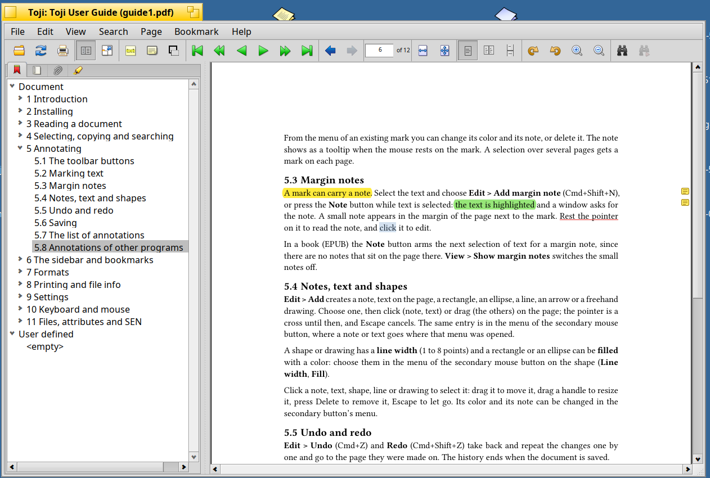
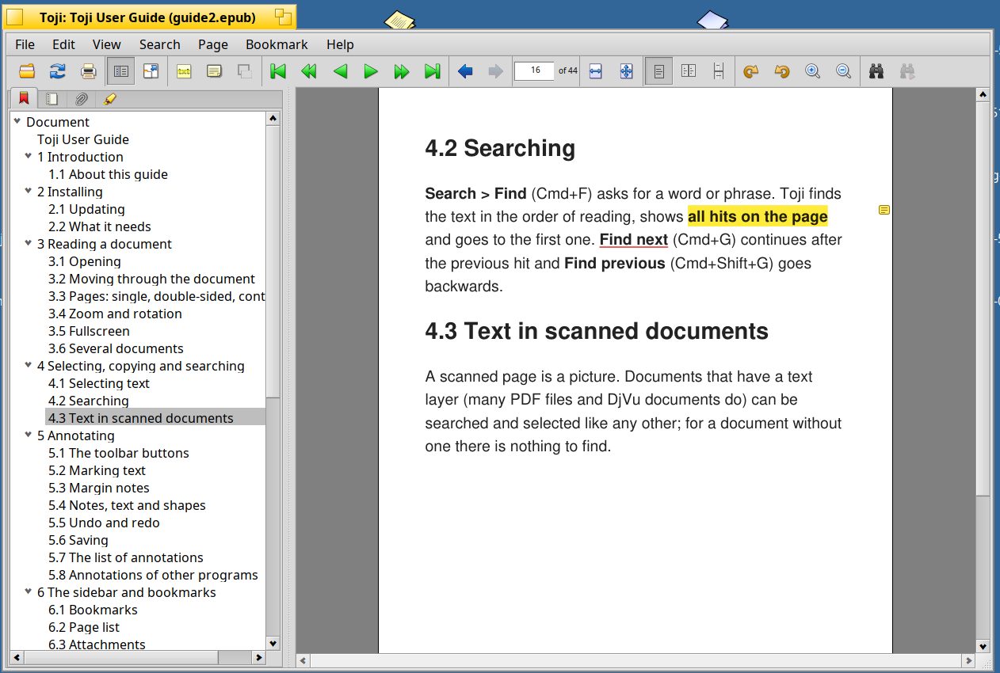
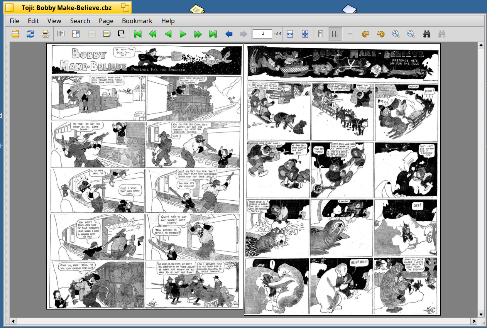
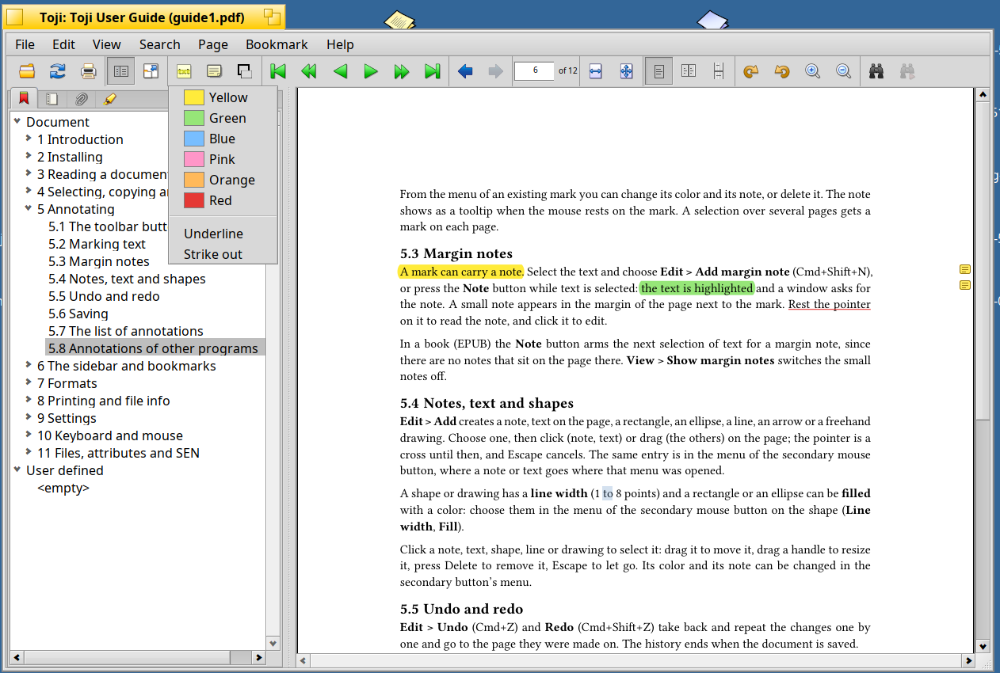

<p align="center">
  
</p>

# Toji™

*綴じ (toji): to bind, to stitch together, the way a book is bound. Toji binds the papers, books and comics you read to what is known about them.*

Toji (formerly Tsundoku) is a document reader for [Haiku](https://www.haiku-os.org), made for the papers and documents we
collect and mean to read. It is a fork of [BePDF](https://github.com/HaikuArchives/BePDF) that renders with
[MuPDF](https://mupdf.com) instead of XPDF: faster, with better quality, and with support for many more formats than
PDF: EPUB books, comics (CBZ, CBR, CB7, CBT, BBF), DjVu, XPS and images.

## Screenshots

| | |
|---|---|
|  |  |
|  |  |

## Formats

| Format | Notes |
|--------|-------|
| PDF | encrypted and password protected files too; annotations are real PDF annotations |
| EPUB | laid out for a text size, anchored marks and bookmarks, metadata in file attributes |
| Comics: CBZ, CBR, CB7, CBT, BBF | double pages, manga (right to left) and webtoons (top to bottom), `ComicInfo.xml` |
| DjVu | text layer, outline, links, metadata, text marks |
| FictionBook (`.fbz`, `.fb2.zip`), XPS, images | through MuPDF |

How each format is read, and the file types: [docs/reference/formats.md](docs/reference/formats.md).

## Features

### Reading

- Pages shown one at a time, two side by side like a book ("Double-sided", the title page can stay alone), or all one below
  the other and scrolled through ("Continuous"). The buttons next to the fit buttons and the View menu switch between them.
- Zooming (in and out, or a rectangle chosen with the mouse), fit to page or width, rotating the page.
- Navigation with the keyboard, the toolbar, dragging, the mouse wheel and links (also those that lead to another page).
- Window mode or fullscreen. Files can be dropped on the window.
- The position and settings per file are kept in BFS attributes and used when the file is opened again.
- Several documents at once: a document is shared by the view and the threads that work on it, so another file can be opened
  in the window while the pages of the first are still rendered in the background.

### The sidebar

Switch it with the icon tabs or Cmd+1 to Cmd+4, show or hide it with Cmd+H.

- **Bookmarks:** the outline of the document and your own (annotations with the motivation `oa:bookmarking`). The outline
  follows the current page.
- **Pages:** the page list. For books it is an outline of chapters.
- **Attachments:** the files embedded in a PDF, which can be saved.
- **Annotations:** all annotations in columns for page, type and the text they mark or hold, sorted by clicking a title;
  choosing one goes there and selects it.

The sidebar is wider by default and collapses on its own if the document has neither an outline nor bookmarks.

### Selecting, copying and searching

- The text can be selected without a mode to switch: hold Option (or Alt) and drag, and the selection follows the text. Double
  click selects a word, triple click a line. The selected text is copied right away. With Shift as well the selection is a
  rectangle, which also copies the picture of that area. The cursor is an I-beam while Option or Cmd is held.
- Dragging without a key moves the page; the secondary button opens a menu (copy, select all, the link actions).
- A selection can run over several pages (the continuous flow, or the two pages of a spread): it is copied or marked page by
  page (a mark on each page). It stays when you zoom or rotate.
- Searching finds the text in the order of reading, continues after the previous hit (also backwards, Shift+G) and shows all hits
  on the page.
- Copy text or graphics to the clipboard, or by drag and drop to other applications (Tracker too).

### Annotating

- **Margin notes:** a mark can carry a note, shown as a small note in the margin of the page (Edit > Add margin note).
- **Shapes** have a line width and an optional fill color.
- **Toolbar buttons:** a marker (choose a color, then select the text), a note, and a menu for text, shapes and drawings arm a
  tool for the next click or selection; Escape puts it down.
- **Marks on text:** highlight, underline, strike out (Edit menu or the menu of the secondary button, with a choice of colors,
  each shown with a sample). From the menu of an existing mark its color and its note can be changed, or the mark deleted; the
  note shows as a tooltip when the mouse rests on the mark.
- **More than text:** Edit > Add (and the same entry in the menu of the secondary button) creates a note, text on the page, a
  rectangle, an ellipse, a line, an arrow or a freehand drawing. Choose one, then click (note, text) or drag (the others) on the
  page; the cursor is a cross until then, and Escape cancels.
- **Editing:** click a note, text, shape, line or drawing to select it; drag it to move it, drag a handle to resize it, press
  Delete to remove it, Escape to let go.
- **Undo and redo** (Cmd+Z, Cmd+Shift+Z) take back and repeat the changes one by one and go to the page they were made on; the
  history ends when the document is saved.
- **Saving:** File > Save (Cmd+S) adds the changes to the end of a PDF file, so its attributes stay as they are. For a file that
  cannot be written (system directory, the title says "read-only") or that MuPDF had to repair, Save and File > Save as…
  (Cmd+Shift+S) write a copy, with the attributes of the original, and Toji goes on with the copy.
- **Where they are kept:** annotations of a PDF are PDF annotations that other readers show. Books, comics and DjVu cannot take
  them in the file, so they are kept in the attribute `SEN:annotations`, and they go along when the file is copied.

What is available where:

| | Text marks | Notes, text, shapes, drawings |
|---|---|---|
| PDF | yes | yes |
| EPUB | yes | no (the pages change with the text size) |
| Comics | no (no text) | yes |
| DjVu | yes | yes |

The model, the storage and the access from other programs: [docs/reference/annotations.md](docs/reference/annotations.md).

### Books

- A book is laid out as pages of 6 by 9 inches for a text size: View > Larger text, Smaller text (Cmd+T, Cmd+Shift+T). The reader
  stays where the text was and the text size is kept in the settings.
- Bookmarks, marks and the place where you stopped reading are tied to the text, not to a page, so they are found again for
  every text size.
- Page numbers (a bookmark of your own, the page to come back to) are only right for the size they were made at.

### Comics

- Double-sided flow that follows how comics are made: a page wider than high is a spread of its own.
- **View > Right to left** for manga: the places of the pages in a spread are swapped, the pages themselves are not mirrored.
- **View > Top to bottom** for webtoons: an endless strip as wide as the window. It is set automatically for a comic that says it
  is a webtoon or whose first pages are very tall.
- The metadata of `ComicInfo.xml` and BBF shows in File info with the cover.

### Links to places

A place in a document is a link: `toji:///path/doc.pdf#page=5`, with the standard fragments for pages, regions, words, EPUB
positions and annotations. **Edit > Copy link to this place** makes one, and `Toji <link>` or `open <link>` follows it
([docs/reference/links.md](docs/reference/links.md)).

### Scripting

Other programs (and `hey`) can read and change the annotations and bookmarks of the document in a window, go to a page or to an
annotation, and save: `hey Toji do AddAnnotation of Document of Window 0 with kind=highlight and quote="the words" and
page=3`. See [docs/reference/scripting.md](docs/reference/scripting.md).

### Printing and information

- Printing (range of pages, even or odd pages only, reverse or in order).
- File info (about the file, the metadata, security).

### Files and metadata

What a document says about itself (title, author, series, language, publisher, date, ISBN, ...) is written to separate BFS
attributes of the file with the names of the established ontologies, so that Tracker can show them as columns and queries can
find them. Settings are stored in `~/config/settings/Toji`, separate from BePDF.

The names and where each value comes from: [docs/reference/metadata.md](docs/reference/metadata.md).

## Why a fork?

Toji is the reader of [SEN](https://github.com/sen-laboratories) (Semantic Extensions Native), which adds semantic
relations between files and documents to Haiku. Reading is where relations become useful, so the reader needs to take
part in them:

- **Navigation:** SEN navigators hand over a target, e.g. the page of a bookmark or reference in a relation, and
  Toji jumps right there. The target is a Web Annotation target (`oa:hasTarget`: a page, a region on it, the words, an EPUB CFI) or the identifier of
  an annotation.
- **Annotations as data:** annotations are described with the W3C Web Annotation model and kept where SEN can find them, even
  without opening the document; every annotation has an identifier, and a scripting suite lets other programs read and change
  them.

Such extensions do not belong into a general purpose reader, so this is an independent fork with its own name,
application signature (`application/x-vnd.sen-labs.Toji`) and release cycle.

## Status

Toji is in **beta**: the features are in and usable, and are being tested. Details such as attribute names may still change
before 1.0 if testing shows a need.

- **Not there yet:** the fonts of a
  document in the file info, fixed-layout EPUB, DRM, JPEG XL and HEIC pages (no translator on Haiku).
- See [PLAN-mupdf.md](PLAN-mupdf.md) for the plans and design notes.

## Installing

Toji and the MuPDF library it needs are in the package repository of SEN Labs:

```
pkgman add-repo https://kiri.sen-labs.org/x86_64
pkgman install toji
```

Each release on GitHub also has the package as a file.

## Building

With the repository above added, `pkgman install mupdf1.28_devel libarchive_devel djvu_devel libzip_devel libxml2_devel freetype_devel` is all that is needed, and
`./build.sh` uses it. Without it, the build gets MuPDF itself, and the development packages of the libraries MuPDF
uses are taken from the system:

```
pkgman install libarchive_devel djvu_devel libzip_devel libxml2_devel freetype_devel harfbuzz_devel openjpeg_devel jbig2dec_devel brotli_devel libjpeg_turbo_devel
git clone https://github.com/sen-laboratories/toji
cd toji
./build.sh
```

This downloads MuPDF 1.28.5 to `3rd-party/` and builds its libraries once (this takes a while), then builds the
application into `dist/Toji`, which needs to stay next to the `docs` folder there. To use another build of
MuPDF set `MUPDF_DIR`.

To build an installable package (`toji-<version>-<arch>.hpkg`) from the result, run `./package.sh`. Copy it to
`~/config/packages` to install it for your user.

The user guide is in [docs/guide](docs/guide) (Markdown); `docs/guide/build.sh` makes HTML, EPUB, PDF and DjVu from it (CI does too,
and the package has the PDF). "Help" in the application opens it.

Bug reports and ideas: [issues](https://github.com/sen-laboratories/toji/issues).

## Credits and license

Toji is free software under the GNU Affero General Public License, version 3 or any later version (see
`LICENSE`). It is based on BePDF, which is under the GNU GPL version 2 or any later version, and renders with MuPDF,
which is under the GNU AGPL version 3.

- © 2026 Gregor B. Rosenauer & Claude
- © 2013-2017 waddlesplash
- © 2000-2011 Michael Pfeiffer
- © 1998-2000 Hubert Figuiere
- © 1997 Benoit Triquet
- The comics in the screenshots: *Bobby Make-Believe* (Chicago Sunday Tribune, 1915, public domain) and *Black Jack ni Yoroshiku*
  (© Shuho Sato / Manga on Web, used with attribution)
- The icon of the shapes button is from [ArtPaint](https://github.com/HaikuArchives/ArtPaint) (MIT)
- and the contributors to [BePDF](https://github.com/HaikuArchives/BePDF), among them Humdinger (the toolbar icons), Augustin Cavalier,
  Markus Himmel and the translators

Toji™, SEN™ and SEN Labs™ are names of SEN Labs e.U.; see [TRADEMARKS.md](TRADEMARKS.md) for what you may do with them.

**The logo and the artwork made for Toji** (`images/`, the program icon) are under [CC BY 4.0](LICENSES/CC-BY-4.0.txt); that
does not give rights to the names Toji and SEN. The documentation is under the same license as the program.

MuPDF, © Artifex Software, Inc. The notes on how it is used on Haiku are in [MUPDF-NOTES.md](MUPDF-NOTES.md).

**The reusable parts are MIT.** The folder [`lib/`](lib/) has the code that SEN and other programs can use without the AGPL:
the Web Annotation model, bookmarks, the readers for EPUB, `ComicInfo.xml` and BBF metadata, and EPUB CFIs. It is under the MIT
license ([lib/LICENSE](lib/LICENSE)) and does not depend on MuPDF or on Toji's sources. Every source file carries an
[SPDX](https://spdx.dev) license identifier line (`AGPL-3.0-or-later` or `MIT`) that tools can read, and `reuse lint` checks it; the license
texts are in [LICENSES/](LICENSES/).
