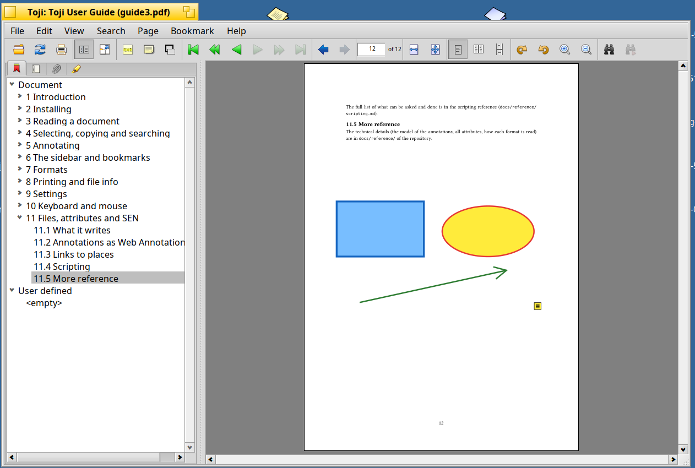

# Annotating

You can mark text and add notes and shapes to pages. Which tools a document offers depends on what it is:

| | Marks on text | Notes, text, shapes, drawings |
|:---|:---|:---|
| PDF | yes | yes |
| EPUB | yes | no (the pages change with the text size) |
| Comics | no (there is no text) | yes |
| DjVu | yes | yes |

## The toolbar buttons

Three buttons of the toolbar do the marking and annotating without the menus. Each one **arms** a tool: the pointer changes, the
next click or selection uses it once, and Escape (or the button again) puts it down. An armed button looks pressed.

| Button | What it does |
|:---|:---|
| **Marker** (highlighter) | opens a menu of colors (and *Underline* and *Strike out*). After you choose, the pointer is an I-beam: select the text (drag, double click for a word, triple click for a line) and it is marked in that color. If some text is already selected, it is marked at once. |
| **Note** | with text selected, a margin note for it (see below). Otherwise the pointer is a cross: click on the page where the note should be, then write it. In a book the next selection of text gets a margin note. |
| **Text, shapes and drawing** | opens a menu (*Text, Rectangle, Ellipse, Line, Arrow, Drawing*); after you choose, the pointer is a cross and you click or drag on the page. |

A small arrow at the corner of the icon of the **Marker** and of the **Text, shapes and drawing** button says that the button opens a
menu. The buttons are dimmed for documents that cannot take what they make (see the table above).

## Marking text

Select the text, then choose **Edit > Highlight selection** (Cmd+Shift+H), **Underline selection** (Cmd+Shift+U) or **Strike out
selection** (Cmd+Shift+K). The secondary mouse button's menu has the same entries with a choice of colors, each shown with a
sample.

From the menu of an existing mark you can change its color and its note, or delete it. The note shows as a tooltip when the mouse
rests on the mark. A selection over several pages gets a mark on each page.

## Margin notes

A mark can carry a note. Select the text and choose **Edit > Add margin note** (Cmd+Shift+N), or press the **Note** button while
text is selected: the text is highlighted and a window asks for the note. A small note appears in the white margin at the right border of the page, at the height of the mark. Rest the pointer on it to read the note: a dotted line shows to which words it
belongs. Click it to edit.

In a book (EPUB) the **Note** button arms the next selection of text for a margin note, since there are no notes that sit on
the page there. **View > Show margin notes** switches the small notes off.

## Notes, text and shapes

**Edit > Add** creates a note, text on the page, a rectangle, an ellipse, a line, an arrow or a freehand drawing. Choose one, then
click (note, text) or drag (the others) on the page; the pointer is a cross until then, and Escape cancels. The same entry is in
the menu of the secondary mouse button, where a note or text goes where that menu was opened.

A shape or drawing has a **line width** (1 to 8 points) and a rectangle or an ellipse can be **filled** with a color: choose
them in the menu of the secondary mouse button on the shape (**Line width**, **Fill**).

Click a note, text, shape, line or drawing to select it: drag it to move it, drag a handle to resize it, press Delete to remove
it, Escape to let go. A double click on a note or a text opens it for editing. Its color and its note can be changed in the secondary
button's menu.

## Undo and redo

**Edit > Undo** (Cmd+Z) and **Redo** (Cmd+Shift+Z) take back and repeat the changes one by one and go to the page they were made
on. The history ends when the document is saved.

## Saving

**File > Save** (Cmd+S) adds the changes to the end of a PDF file, so that its attributes stay as they are. For a file that
cannot be written (a system folder, or the title says "read-only") or that MuPDF had to repair, **Save** and **File > Save as**
(Cmd+Shift+S) write a copy, with the attributes of the original, and Toji goes on with the copy.

EPUB books, comics and DjVu documents cannot take annotations inside them. Their annotations are kept in the attribute
`SEN:annotations` of the file; they go along when the file is copied in Tracker, and **Save as** copies them with the document.

## The list of annotations

**View > Show annotations** (Cmd+4) lists all annotations of the document in columns for page, type and the text they mark or
hold. Click a title to sort; choosing one goes there and selects it.

## Annotations of other programs

A PDF file that was annotated by other programs shows their annotations. When Toji opens it, it also describes them in the
attribute `SEN:annotations`, without changing the PDF, and gives those that have no name an identifier so that other programs can
refer to them (see [Settings](#settings) and [Files, attributes and SEN](#files-attributes-and-sen)).
