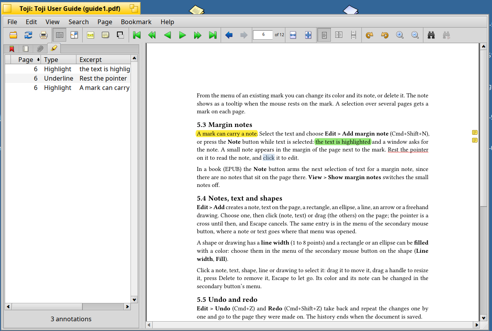

# The sidebar and bookmarks

The sidebar has four tabs, with icons (the tooltip names them): **bookmarks**, **page list**, **attachments** and **annotations**.
Switch with Cmd+1 to Cmd+4, and hide or show the sidebar with Cmd+H or the button next to the fullscreen button. It is wide by
default and collapses on its own if the document has neither an outline nor bookmarks.

## Bookmarks

The first tab has the **outline** of the document (chapters and sections, as the document defines them; it follows the current
page) and **your own bookmarks**.

- **Bookmark > Add** makes a bookmark for the current page; you give it a label. **Edit** changes the label, **Delete** removes
  the bookmark of the page.
- In a book a bookmark is a place in the text, not a page number: it is found again when you change the text size.

Bookmarks are kept in the attribute `SEN:annotations` of the file as annotations with the motivation `oa:bookmarking`, so
that other programs can use them too. Bookmarks that BePDF made are taken over.

## Page list

The second tab lists the pages; in a book it lists the chapters, with the pages of the chapter that is read below it.

## Attachments

Files embedded in a PDF are listed in the third tab (**View > Show attachments**), and can be saved.

## Annotations

The fourth tab is the [list of annotations](#the-list-of-annotations).

