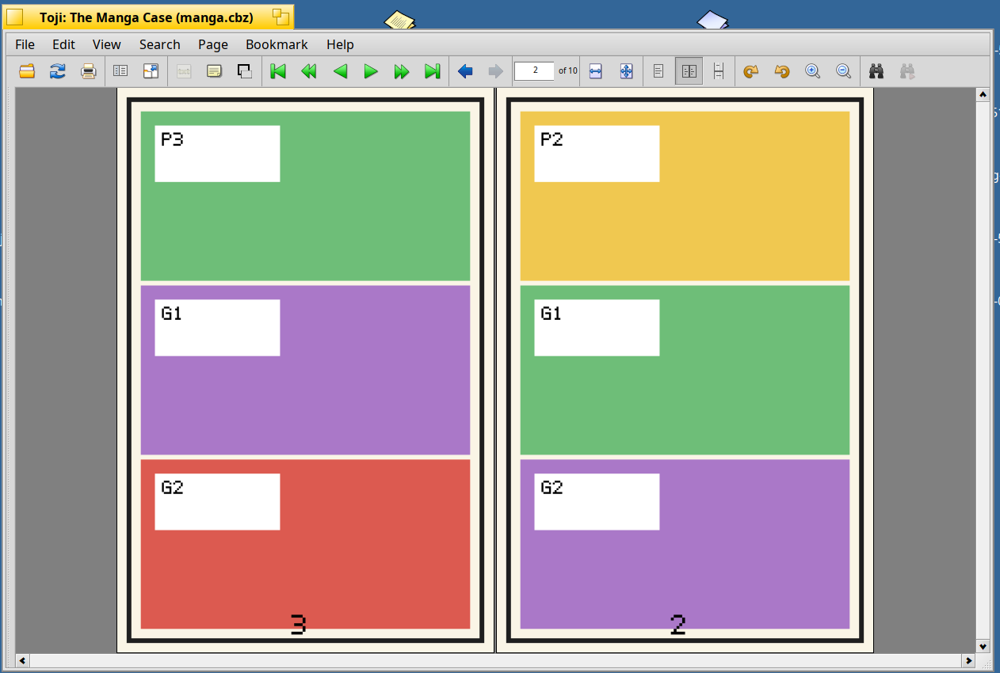
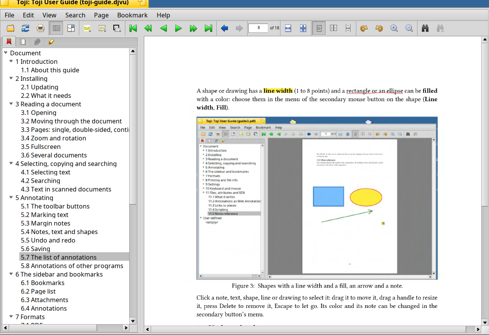

# Formats

## PDF

Encrypted and password protected files open after the password is given. The annotations that other programs made are shown,
and yours are normal PDF annotations that other readers show too. Form fields are displayed.

## EPUB books

A book has no fixed pages, so Toji lays it out as pages of 6 by 9 inches for a text size. **View > Larger text** (Cmd+T) and
**Smaller text** (Cmd+Shift+T) change it; you stay where the text was. The text size is kept in the settings.

When the text size changes, the book is laid out again in a thread of its own, so the window does not freeze; a small window
with a barber pole says so if it takes more than a moment.

- **Contents:** the page list is an outline of chapters.
- **Metadata:** the title, authors, series, language, publisher, date, identifier, subjects, description and cover are read from
  the book and written to the file's attributes; **File > File info** shows them with the cover.
- **Marks** (highlight, underline, strike out) and **bookmarks** are tied to the text, so they stay in place when the pages
  change. A mark that runs over a page break is drawn on both pages.
- Page numbers (a bookmark you made, the page to come back to) are only right for the text size they were made at; the number
  of pages in the file info is the one for the standard text size.

An EPUB read from right to left (a manga or a book in Arabic or Hebrew) says so in its reading order, and Toji follows.

## Mobipocket and Kindle books

Mobipocket books (`.mobi`, `.prc`) and the books of a Kindle without DRM (`.azw`, `.azw3`, the newer KF8 format) open like EPUB
books, with a text size, contents, cover, metadata and marks. Toji reads the Mobipocket format itself and makes an EPUB of it in the temporary folder for as long as
the book is open; the file is not changed (apart from its attributes and your marks, as for any book).

- **Not read:** books with **DRM** (the book says it is protected: the error messages window has the reason), the newest Kindle
  format (`.kfx`) and the old Huffman compression. Books that have both formats (many have) open as KF8.
- Images, links, the table of contents and the cover of the book come along.

## Comic books

CBZ (ZIP), CBR (RAR), CB7 (7z) and CBT (TAR, also compressed) open like PDF files, and so do Bound Book Format files (`.bbf`).
Pages in WebP and AVIF are converted by the translators of Haiku. What file managers put into archives (`__MACOSX`, `._*`) is
ignored.

- **Double pages:** in the double-sided flow a page that is wider than high is a spread of its own and fills the view.
- **Manga:** **View > Right to left** swaps the places of the pages in a spread (the first page on the right). The pages themselves
  are never mirrored. A manga says so in its `ComicInfo.xml`, and Toji remembers your choice for the file.
- **Webtoons:** **View > Top to bottom** reads a strip from the top to the bottom as an endless page as wide as the window. A comic
  that says it is a webtoon, or whose first pages are very tall, opens this way by itself.
- **Metadata:** `ComicInfo.xml` (title, series and number, writers, artists, publisher, date, genres, language, summary) is written
  to the file's attributes; **File info** shows it with the cover.
- **Annotations:** notes, text, shapes and drawings work like in a PDF (there is no text to mark); they are kept in the file's
  attribute `SEN:annotations`.

## DjVu

DjVu documents open like PDF files. The hidden text layer works: search, selection, copy and marks. The outline, the links
(also to other pages of the file) and the metadata are those of the file. A document in several files (an index with files next to
it) opens as well, and pages that are stored turned are shown right.

## Other formats

XPS files, FictionBooks (`.fbz`, `.fb2.zip`) and pictures open through MuPDF.

## Not (yet) supported

Fixed-layout EPUB, DRM, JPEG XL and HEIC pages in comics (Haiku has no translator for them).
