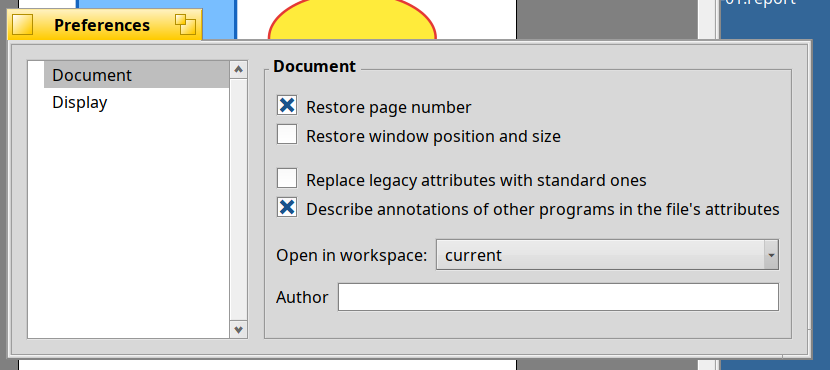

# Settings

**Edit > Settings** opens the preferences. They are stored in `~/config/settings/Toji`, separate from BePDF.

## Document

- **Restore page number:** open a file where you stopped (on by default).
- **Restore window position and size:** the window comes back where it was for this file.
- **Open in workspace:** which workspace a new window opens in.
- **Author:** the name that goes into the annotations you make.
- **Replace legacy attributes with standard ones:** files that BePDF has opened have attributes with BePDF's own names
  (`META:title`, `META:author`, ...). Toji writes the same information with standard names (`dc:title`, `dc:creator`, ...) in
  any case. The legacy attributes are kept, so you can go back to BePDF, unless this is on: then their values are moved to the
  standard names and the old ones are removed. The first time Toji sees such a file it asks what you want and remembers.
- **Describe annotations of other programs in the file's attributes:** when a PDF is opened, its annotations are described in the
  attribute `SEN:annotations`, and those that have no name get an identifier. The PDF file itself is not changed.

## Display

- **Fullscreen mode:** show only the document, or the toolbar, status bar and scroll bars too.
- **Selection:** whether a rectangular selection is filled or only outlined.
- **Invert vertical scrolling** and other details of the display.

## Printing

Default print options (selection, order, color mode).

## Window settings

Where the small windows (find, file info, error messages) appear are remembered per window.
